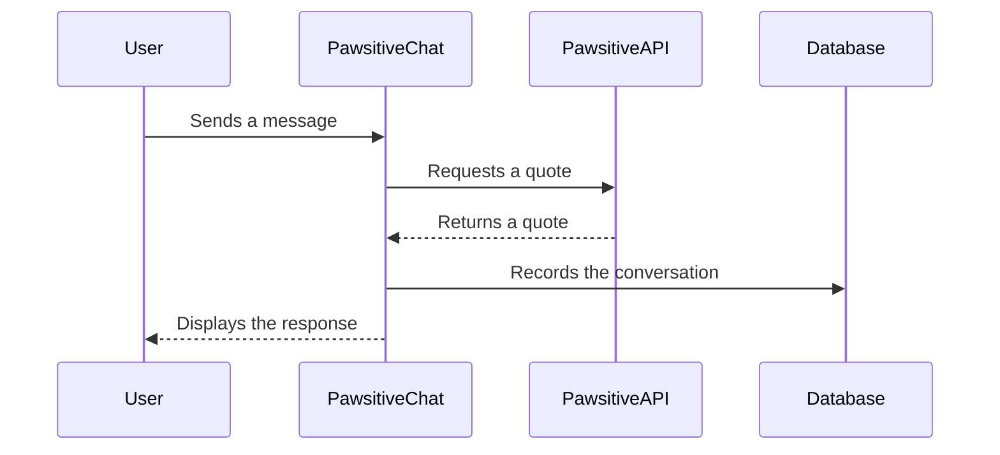

# PawsitiveQuotes
> This application is a school project for a Java course.

PawsitiveQuotes is a Java Spring Boot application designed to boost employee morale by providing a platform for them to express their concerns and receive inspirational quotes in return. 
It consists of two main components:

1.  **PawsitiveAPI:** A Spring Boot API that provides random inspirational quotes from a database.
2.  **PawsitiveChat:** A Spring Boot application with a conversation page and a user/conversation history page.

## Table of Contents

*   [Features](#features)
*   [Setup and Installation](#setup-and-installation)

## Features

*   **Conversation Interface:** Users can enter their name and message on a conversation page.
*   **Inspirational Quotes:** An API provides random "quotes inspirantes" from a database, offering motivational support to users.
*   **Data Persistence:** User conversations are saved to a database, including the username, message, quote, and timestamp.
*   **User and Conversation History:** A dedicated page displays a list of users who have posted, along with the ability to view their conversation history.
*   **API Integration:** The main application calls the quote API using RestTemplate.



## Setup and Installation

Follow these steps to set up and run the project:

1.  **Clone the Repository:**
    ```
    git clone [repository URL]
    cd PawsitiveQuotes
    ```

2.  **Configure Application Properties:**

    *   For both the `PawsitiveAPI` and `PawsitiveChat`, you will find a file named `application.properties.example`.
    *   **Copy** this file and **rename** the copy to `application.properties` in the respective directory (`PawsitiveAPI` and `PawsitiveChat`).

    *   Edit each `application.properties` file to configure the database connection and other settings. Here's an example of the contents of the `application.properties.example` file:

        ```
        spring.application.name=PawsitiveChat

        spring.jpa.hibernate.ddl-auto=update
        spring.datasource.url=jdbc:mysql://${MYSQL_HOST:localhost}:3306/PawsitiveQuotes
        spring.datasource.username=root
        spring.datasource.password=<YOUR_PASSWORD>
        spring.datasource.driver-class-name=com.mysql.cj.jdbc.Driver

        server.port=8080
        ```

        *   **Note:** You can use a single database for both the API and the main application by using the same database name (`PawsitiveQuotes` in the example). If you prefer, you can use separate databases by specifying different database names for each application.  Make sure to configure the `spring.datasource.url`, `spring.datasource.username`, and `spring.datasource.password` properties accordingly.

3.  **Build and Run PawsitiveAPI:**
    ```
    cd PawsitiveAPI
    mvn clean install
    mvn spring-boot:run
    ```

4.  **Build and Run PawsitiveChat:**
    ```
    cd ../PawsitiveChat
    mvn clean install
    mvn spring-boot:run
    ```

5.  **Access the Application:**

    *   Open your web browser and go to `http://localhost:8080` to access the conversation page. (for `PawsitiveChat`)
    *  Open your web browser and go to `http://localhost:8181/api/quote` to access the quote (for `PawsitiveAPI`)
    *   Visit `http://localhost:8080/users` to see the list of users and their conversations.
